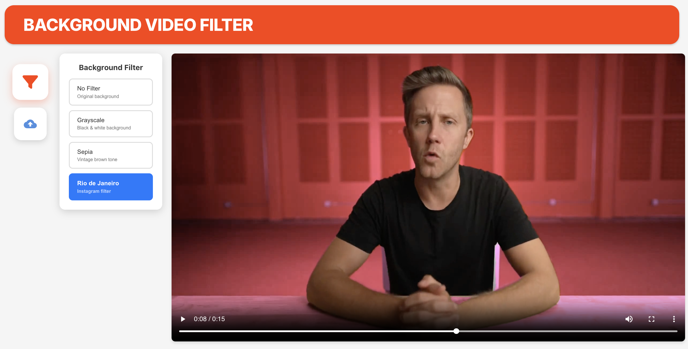

# Background Video Filter System

A full-stack web application that applies visual filters to video backgrounds while keeping the subject in full color. Built as a technical assessment demonstrating person segmentation, real-time video processing, and modern web development practices.

## Project Objective

Create a system that distinguishes between a person (foreground) and the background in a video, applying different visual effects to each region:
- **Background**: Apply video effects (black & white, sepia, Instagram-style filters, etc.)
- **Speaker/Person**: Keep in full color, unaffected by filters

## Features



### Core Functionality
1. **Person Detection**: Uses MediaPipe's selfie segmentation model to identify people in video frames
2. **Background Segmentation**: Separates the person from the background
3. **Selective Filtering**: Applies visual filters only to the background while preserving the person in color
4. **Real-time Display**: Streams processed video with smooth playback

### Available Filters
- **None**: Original video without any processing
- **Grayscale**: Black and white background with color person
- **Sepia**: Vintage brown-toned background
- **Rio de Janeiro**: Instagram-style purple/magenta filter

### User Interface Features
- **Instant Filter Switching**: Toggle between filters in real-time without reprocessing
- **Video Upload**: Support for both file uploads and YouTube URLs
- **Synchronized Playback**: All filter variations stay perfectly in sync
- **Responsive Design**: Clean, modern interface with smooth animations

## Architecture

### Project Structure

```
Technical-Assessment/
├── assets/                     # Documentation and media files
│   └── webapp.jpeg            # Screenshot for README
│
├── backend/                    # Python Flask server
│   ├── main.py                # API endpoints and video processing
│   ├── helpers.py             # Filter functions and utilities
│   ├── requirements.txt       # Python dependencies
│   ├── processed_cache/       # Cached processed videos
│   ├── uploaded_videos/       # User-uploaded video files
│   └── temp/                  # Temporary files during processing
│
└── frontend/                  # React TypeScript app
    ├── src/
    │   ├── App.tsx           # Main application component
    │   ├── consts.ts         # Configuration constants
    │   ├── components/
    │   │   └── VideoPlayer.tsx  # Reusable video player
    │   └── index.tsx         # Application entry point
    ├── package.json          # Node.js dependencies
    └── public/               # Static assets
```

### Technology Stack

#### Backend
- **Flask**: Lightweight Python web framework for REST API
- **MediaPipe**: Google's ML solution for person segmentation
- **OpenCV**: Computer vision library for video processing
- **FFmpeg**: Video encoding and audio processing
- **yt-dlp**: YouTube video downloading

#### Frontend
- **React 18**: Modern UI framework with hooks
- **TypeScript**: Type-safe JavaScript
- **CSS-in-JS**: Inline styles for component encapsulation

## Getting Started

### Prerequisites

- **Python 3.8+**: For backend processing
- **Node.js 16+**: For frontend development
- **FFmpeg**: For video encoding
  ```bash
  # macOS
  brew install ffmpeg
  
  # Ubuntu/Debian
  sudo apt-get install ffmpeg
  
  # Windows
  # Download from https://ffmpeg.org/download.html
  ```
- **pip**: Python package manager (comes with Python)
- **npm or yarn**: Node.js package manager (comes with Node.js)

### Quick Start

#### 1. Backend Setup

```bash
# Navigate to project root
cd Technical-Assessment

# Create and activate virtual environment (recommended)
python3 -m venv venv
source venv/bin/activate  # On Windows: venv\Scripts\activate

# Install Python dependencies
pip install -r requirements.txt

# Start the backend server
cd backend
python main.py
```

**Backend is ready!** You should see: `Running on http://127.0.0.1:8080`

#### 2. Frontend Setup

**Open a new terminal window:**

```bash
# Navigate to frontend directory
cd Technical-Assessment/frontend

# Install Node.js dependencies
npm install

# Start the React development server
npm start
```

**Frontend is ready!** Browser will automatically open at `http://localhost:3000`

### Troubleshooting

**Backend won't start:**
- Ensure virtual environment is activated: `source venv/bin/activate`
- Check dependencies: `pip list | grep -E "(mediapipe|opencv|flask)"`
- Verify FFmpeg is installed: `ffmpeg -version`

**Frontend won't start:**
- Clear node_modules and reinstall: `rm -rf node_modules && npm install`
- Check Node version: `node --version` (should be 16+)

**Video processing is slow:**
- First-time processing takes longer (downloads MediaPipe model)
- Processing happens once, then results are cached
- Subsequent filter switches are instant

## How to Use

### Basic Workflow

1. **Start Both Servers** (backend on :8080, frontend on :3000)
2. **Watch Processing** (first time only - takes ~30 seconds per minute of video)
3. **View Default Video**: The app automatically loads a demo video
4. **Try Different Filters**: 
   - Click the **filter icon** on the left sidebar to open the filter menu
   - Select any filter (None, Grayscale, Sepia, Rio de Janeiro)
   - Watch the background change instantly!
5. **Switch Filters** instantly after initial processing - all variations stay perfectly synchronized

### Uploading Videos

#### Option 1: YouTube URL
1. Click the upload icon
2. Select "Paste URL" tab
3. Enter YouTube URL (e.g., `https://youtube.com/watch?v=xxx`)
4. Click "Load Video"

#### Option 2: File Upload
1. Click the upload icon
2. Select "Upload File" tab
3. Drag and drop or click to select video file
4. Supported formats: MP4, MOV, AVI, WebM, MKV
5. Max size: 100MB

### Understanding the Processing

**First Request (Takes Time)**:
- Downloads video (if URL) or reads file
- Extracts audio track
- Processes every frame with MediaPipe
- Applies ALL filters at once (efficient!)
- Encodes 4 separate videos (one per filter)
- Caches all versions

**Subsequent Requests (Instant)**:
- Serves from cache
- No reprocessing needed
- Switching filters is seamless

### API Endpoints

**Health Check**:
```bash
curl http://127.0.0.1:8080/hello-world
```

**Process Video**:
```bash
curl "http://127.0.0.1:8080/get-processed-video?video_url=<URL>&filter=grayscale"
```

Parameters:
- `video_url`: Video source (YouTube or direct link)
- `filter`: `none`, `grayscale`, `sepia`, or `rio`

**Upload Video**:
```bash
curl -X POST -F "video=@/path/to/video.mp4" http://127.0.0.1:8080/upload-video
```

## How It Works

### Backend Processing

The backend uses **MediaPipe** for AI-powered person segmentation and **FFmpeg** for video encoding:

**Why MediaPipe?**
- Runs on CPU (no expensive GPU needed)
- Pre-trained and accurate
- Fast enough for real-time processing

**Processing Flow:**
1. Download video (YouTube via yt-dlp, or direct URL)
2. Extract audio track with FFmpeg
3. Process each frame: MediaPipe detects person, applies filters to background only
4. **Batch efficiency**: Apply all 4 filters at once (4x faster than processing separately)
5. Encode with H.264, merge audio back
6. Cache all versions using MD5 hash of video URL

**Key Design Choice:**
Processing all filters simultaneously saves time because reading frames and running AI are the slow parts, switch pre-loaded videos is fast. This means first-time processing generates all filter variations at once, then serving any filter is instant.

### Frontend Architecture

The frontend uses **synchronized multi-video** approach for instant filter switching:

**How it Works:**
- Loads all 4 filter variations as separate `<video>` elements
- All videos play in perfect sync (same timestamp, play/pause state)
- Only the selected filter is visible (`display: none` on others)
- Switching filters = instant (just toggle visibility)

**Why Not Client-Side Processing?**
- Server-side caching benefits all users
- Consistent results across browsers/devices
- Offloads work from user's device
- Experienced slight pause between switching filters

## Next Steps & Future Improvements

### Performance Optimization
- **Advanced Segmentation Models**: While MediaPipe provides excellent speed and accuracy for this use case, there are more sophisticated background/foreground segmentation systems available (e.g., DeepLabV3+, U-Net). The choice between these models should be driven by business requirements—prioritizing accuracy versus video processing time and user experience.
- **Stream Processing**: Implement chunk-based video processing to enable real-time streaming and reduce memory footprint, rather than loading entire videos into memory.
- **Scalable Caching Strategy**: The current file-based caching system works well for moderate traffic but would require architectural changes for production-scale deployment. At scale, this could be addressed through:
  - Cloud-based object storage (S3, Google Cloud Storage) with CDN distribution
  - Distributed caching layer (Redis, Memcached) for metadata

### User Experience Enhancements
- **Enhanced Filter Controls**: Add user-configurable parameters for existing filters (intensity, saturation, contrast adjustments)
- **Progress Indicators**: Implement detailed loading screens with progress bars showing:
  - Video download/upload status
  - Frame processing completion percentage
  - Estimated time remaining
- **Expanded Filter Library**: Add additional visual effects including:
  - Edge detection and artistic effects
  - Custom color grading presets
  - Background replacement with static images or videos